# DEVELOPERS GUIDE

[TOC]

## Introduction

This service accepts helmfile or integration chart archive as tgz files and apply them to a target cluster.
The result is one or more Helm releases installed on the cluster using one or more namespaces, in parallel/sequential groups.
Helmfile leverages the helm-diff plugin to find out what Helm releases need to be updated and delegates the execution to Helm itself.
This service will also accept integration charts for those who haven't migrated to Helmfile yet to support legacy.

This guide does not cover every detail of the API. For a full definition verify:

* [REST API Specification](https://apiguild.internal.ericsson.com/catalog/#api-portal/api-finder/api-viewer?id=0a922707-e81e-4e10-a66a-db4d22c64033&version=1.3.0)

## Prerequisites

In this Prerequisites section we will run through some general settings that shall be considered in the beginning.

### General

As mention in the [Introduction](#introduction), Helmfile Executor may be deployed in three different ways:

1. As a standalone microservice, consider: [Helmfile Executor User Guide](https://adp.ericsson.se/marketplace/helmfile-executor/documentation/development/dpi/service-user-guide)
2. With an integration chart, consider: [CN AM Integration Chart Components](https://gerrit-gamma.gic.ericsson.se/plugins/gitiles/OSS/com.ericsson.orchestration.mgmt/cn-app-mgmt-integration-chart/+/refs/heads/master/eric-cn-app-mgmt-integration/requirements.yaml) and [CN AM Integration Chart Artifactory](https://arm.sero.gic.ericsson.se/artifactory/proj-bdgs-cn-app-mgmt-drop-helm/eric-cn-app-mgmt-integration/)
3. With a helmfile, consider: [CN AM Helmfile](https://gerrit-gamma.gic.ericsson.se/plugins/gitiles/OSS/com.ericsson.orchestration.mgmt/cn-app-mgmt-integration-chart/+/refs/heads/master/helmfile/helmfile.yaml)

#### Kubernetes Cluster Access

Make sure to have access to a cluster. You may check your config file:

```bash
kubectl config view
```

If it is not available, you may retrieve the config file information from your Kubernetes Management System and paste it to ~/.kube/config.

#### Postgres

Helmfile Executor is depedent on a postgres database. Make sure it is running.
Firstly, you may check if the postgres container is running:

```bash
docker container ls
```

Sample output:

CONTAINER ID | IMAGE  | COMMAND | CREATED | STATUS | PORTS | NAMES
---|---|---|---|---|---|---
468c3ae8e2bf | postgres | "docker-entrypoint.s…" | 34 seconds ago | Up 32 seconds | 0.0.0.0:8200->5432/tcp, :::8200->5432/tcp | priceless_lamport

If there is no postgres instance running. Start the container with:

```bash
docker run -e POSTGRES_PASSWORD=<POSTGRESS_PASSWORD> -p 8200:5432 -d postgres
```

### Helmfile

Helmfile is a declarative spec for deploying helm charts. For more information on Helmfile, kindly refer to the [Helmfile Project](https://github.com/roboll/helmfile).
If you choose to deploy via Helmfile, make sure that you have helmfile and the helm-diff plugin installed.

#### Helmfile installation

1. Download helmfile from here:

   ```bash
   https://github.com/roboll/helmfile/releases
   ```

2. Create bin folder (make sure it is part of $PATH variable) and move helmfile there, i.e.:

   ```bash
   mv <YOUR_HELMFILE_INSTANCE> ~/usr/bin/helmfile
   chmod +x ~/usr/bin/helmfile/releases
   ```

#### Helm-diff plugin

Check if helm-diff plugin is available

```bash
helm plugin list
```

sample output:

NAME | VERSION | DESCRIPTION
---|---|---
diff | 3.1.3 | Preview helm upgrade changes as a diff

If the helm-diff plugin is not available, download helm-diff from here: `https://github.com/databus23/helm-diff/releases` and unzip
to /home/$USER/.local/share/helm/plugins. You may need to create the path (/home/$USER/.local/share/helm/plugins) and make sure that the
unzipped directory is named "diff".

## Basic project operations

### How to download project source

Clone project from gerrit page:

1. Go to the [gerrit page](https://gerrit-gamma.gic.ericsson.se/#/admin/projects/OSS/com.ericsson.orchestration.mgmt/eric-lcm-helm-orchestrator)
2. Choose "Clone with commit-msg hook"
3. Put "Copy" icon
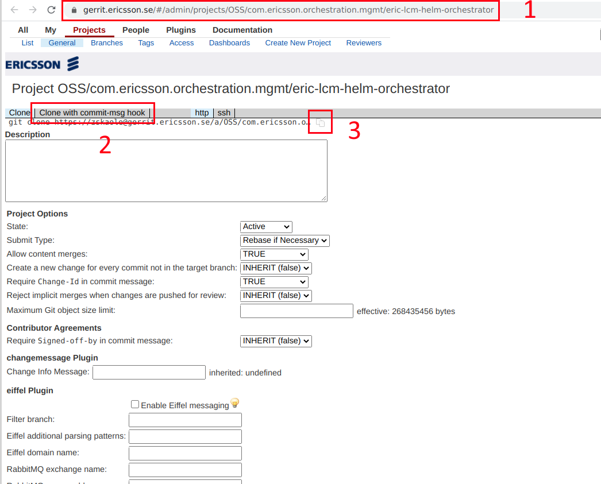
4. Go to the appropriate folder on your computer
5. Run the command line for the current directory and execute the command from the clipboard

After a short time, a project folder will appear on your computer. Folder name: "eric-lcm-helm-orchestrator".

### How to start Helm Executor locally from Intellij IDEA

1. Start docker image with postgres (it is needed for tests):

   ```bash
   docker pull quay.io/testcontainers/ryuk:0.2.3
   docker run -e POSTGRES_PASSWORD=postgres -p 8200:5432 -d postgres
   ```

2. Go to eric-lcm-helm-orchestrator/eric-lcm-helm-executor-server/src/main/resources/application.yaml
3. Change in "application.yaml" property "profiles.active" to "local"
4. Create configuration for starting:
   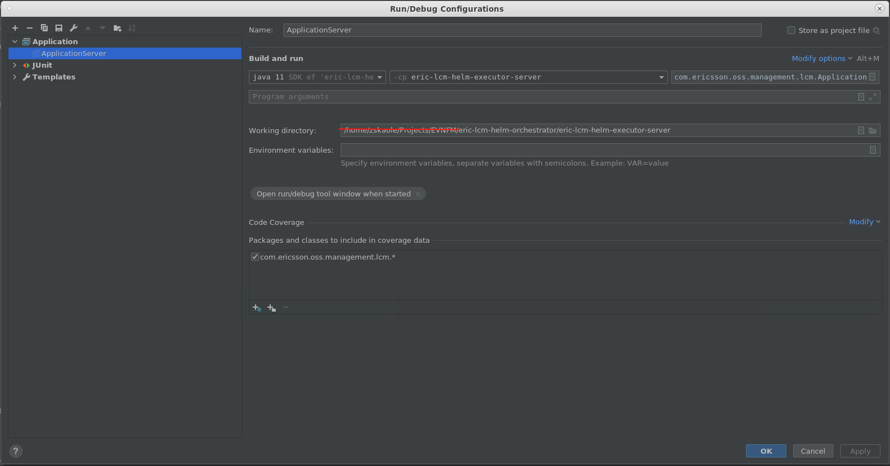
5. In the field "Working directory" choose your own absolute path to eric-lcm-helm-executor-server module
6. Go to Maven bookmark and start "clean install" in "Cloud Native Application Manager Helm Orchestrator Service"
   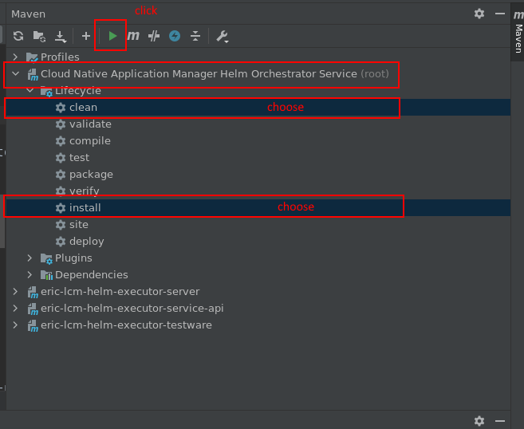
7. If all ok, you will get message: BUILD SUCCESS.
8. Start application using prepared configuration from step 4.

### How to send requests to local application

How to send test requests to the application is explained using Postman as an example. You can use any client that suits you.

1. Import the request collection into Postman. You can find it here:  eric-lcm-helm-orchestrator/postman/collections/requests.json

2. Import the Postman environment. You can find it here: eric-lcm-helm-orchestrator/postman/collections/environments.json

3. How to import request collection and environment you can read in
   [official documentation](https://learning.postman.com/docs/getting-started/introduction/).

4. For requests "Instantiate Workload" and "Update Workload" you must specify the path to the files that will be used for the request.
   In the project, these files are here: eric-lcm-helm-orchestrator/postman/workloadInstance/instantiate
   But since the project for each user can be in different places on the computer, then the absolute path to the files will be different for each user.
   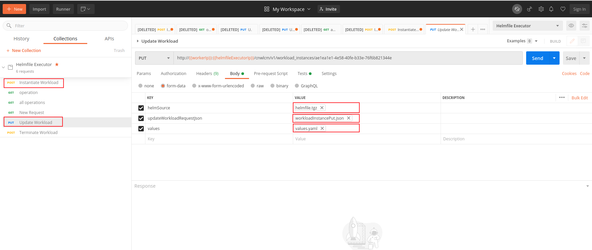
   For each key, select the path to the corresponding file.

5. Use Postman requests to test application work. All requests will be described in detail in the
   [WorkloadInstance life cycle section](#workloadinstance-life-cycle)

## Features

### DELETE NAMESPACE

Functionality to delete the namespace is present in Terminate POST request. More information is available in WorkloadInstance life cycle
[TERMINATE](#terminate). This functionality allows to delete the namespace in case there are no viable instances left after the termination process.

To delete a namespace, all required conditions need to be followed:

* all instances in the namespace should be terminated successfully or auto-rolled back after a failed instantiation;
* there are no pods in namespace;

To enable or disable this functionality, set the *deleteNamespace* parameter to *true* or *false* in workloadInstanceOperationPostRequestDto.
If *deleteNamespace* parameter is not present in the request, by default it will be set to *true*.

Body of the request must include:

* workloadInstanceOperationPostRequestDto;
* clusterConnectionInfo file; (optional)

Example of workloadInstanceOperationPostRequestDto

```json
{
  "type": "terminate",
  "deleteNamespace": true
}
```

Send a request from the Postman, you will get a response like this:
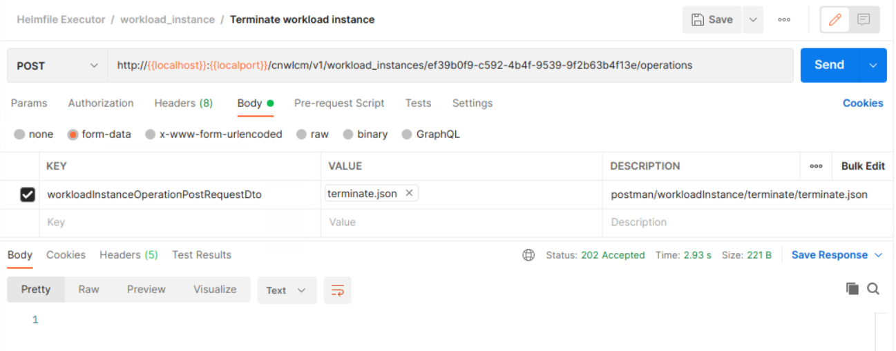

We can get operation id from headers as on picture below
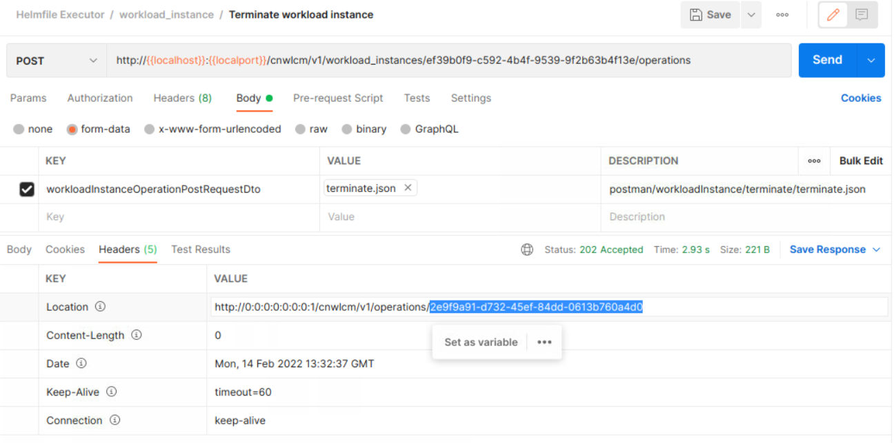

The instance will be terminated on cluster, but won`t be deleted from the DB.
To see the result of the terminate operation, we need to send the GET request with operation id to the endpoint get operation
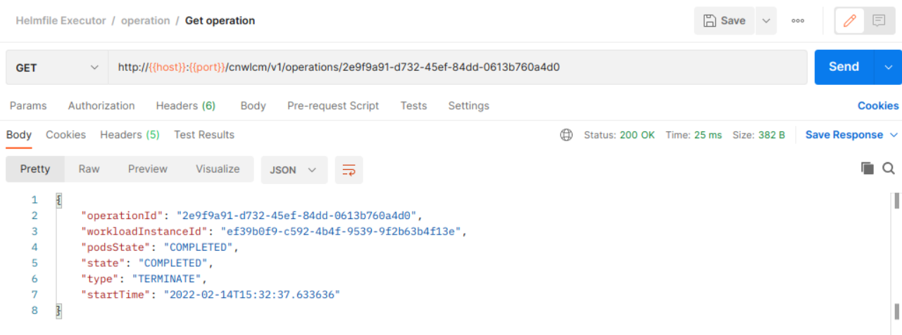

To check namespace presence utilize command:

```bash
kubectl get namespaces
```

## WorkloadInstance life cycle

Helm Executor stores files from the request in the temporary folder before command execution and deletes this folder after execution is finished.

HelmSource file is stored in postgres db and values file composed with additionalParams is saved in CM Store.

Kube config file is not stored during the LCM Operation requests.

### INSTANTIATE

There are several options how to instantiate your helmfile/chart: via tgz files (common), via url (Helmfile Fetcher) and via DTO (Helmfile Builder).

#### Common instantiate

The "instantiate" request performs a POST request to the server that creates workload instance on a kubernetes cluster.
Body of the request should include the following fields:

* helmSource file;
* workloadInstancePostRequestDto;
* values file;
* clusterConnectionInfo file; (optional)

Send a request from the Postman, you will get a response like this:

```json
{
    "workloadInstanceId": "58d81ecb-e47f-46f3-8ff2-1341c1bdf62d",
    "workloadInstanceName": "successfulpost",
    "namespace": "namespace",
    "crdNamespace": "crdnamespace",
    "cluster": "kubernetes",
    "helmSourceVersions": [
        "1.2.3-4"
    ],
    "version": null,
    "additionalParameters": {
        "cn-am-test-app-a.enabled": true
    }
}
```

We can get operation id from headers as on picture below
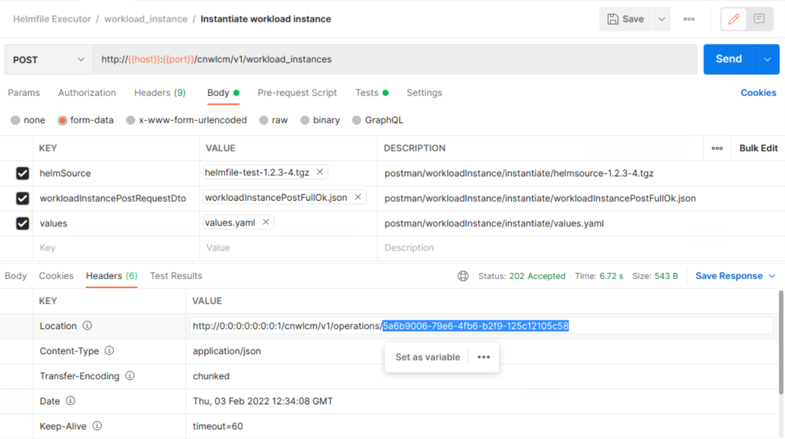

to see the result of the instantiate operation, we need to send the GET request with operation id to the endpoint get operation
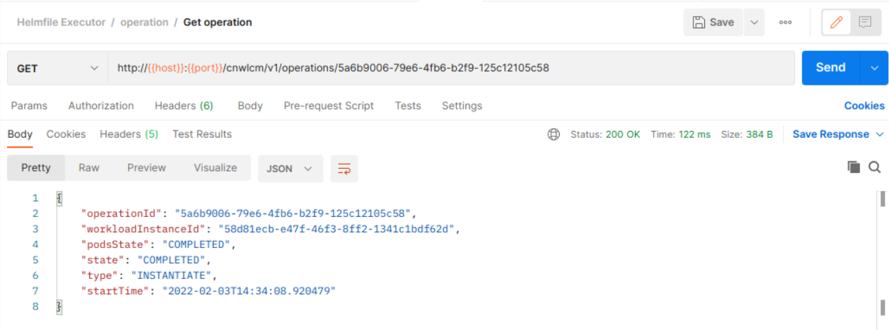

Use the received "workloadInstanceId" for other requests, for example, for an UPDATE.

Instantiate logic:

* Create WorkloadInstance object, based on data from workloadInstancePostRequestDto
* Save created object to the database
* If WorkloadInstance contains information about the cluster, then attach WorkloadInstance to the cluster
* Create a folder and put all the files received in the request into it (values, helmSource, kubeConfigPath)
* Create HelmSource object, linked to WorkloadInstance
* Create an Operation object to track the current operation status
* Perform the Operation (deploy your instance on cluster)
* Return WorkloadInstanceDto in response

For *auto-rollback.enabled=true*: in case of INSTANTIATE fails, AUTO-ROLLBACK will be applied. It will uninstall all deployed releases, if they were installed during failed INSTANTIATE operation.

#### Instantiate via url (Helmfile Fetcher)

The "instantiate" via Helmfile Fetcher is very similar to common instantiate. The only difference, user doesn't send entire
helmfile or integration chart archive, but only link to this archive. Right now we support link to chart registry via Ingress, credentials to which are sent to HFE
during deployment - check them in [Deployment Guide](https://adp.ericsson.se/marketplace/helmfile-executor/documentation/development/dpi/service-deployment-guide).
By default, HFE consider any URL as url to chart registry, if you want to disable such behavior - set *isUrlToHelmRegistry* request parameter to *false*.

User performs a POST request to the server that creates workload instance on a kubernetes cluster.

Body of the request should include the following fields:

* workloadInstanceWithURLRequestDto;
* values file;
* clusterConnectionInfo file; (optional)

Example of workloadInstanceWithURLRequestDto:

```json
{
  "workloadInstanceName": "successfulpost",
  "url": "https://vnfm.ccd-c16a027-iccr.athtem.eei.ericsson.se/vnfm/onboarding/api/vnfpkgm/v1/vnf_packages/7f85bdd1-4a51-404a-9025-971ce80ab01f/helmfile",
  "namespace": "namespace",
  "crdNamespace": "crdNamespace",
  "cluster": "cluster",
  "timeout": 2,
  "additionalParameters": {
    "eric-ctrl-bro.bro.enableAgentDiscovery": true
  }
}
```

For *auto-rollback.enabled=true*: in case of INSTANTIATE fails, AUTO-ROLLBACK will be applied. It will uninstall all deployed releases, if they were installed during failed INSTANTIATE operation.

#### Instantiate via Helmfile Builder

The "instantiate" via Helmfile Builder is very similar to common instantiate with basically the same values.
Request performs a POST request to the server that creates workload instance on a kubernetes
cluster, also in request each chart must contain order or none of them.

Body of the request should include the following fields:

* workloadInstanceWithChartsRequestDto;
* globalValues file;
* clusterConnectionInfo file; (optional)

Example of workloadInstanceWithChartsRequestDto

```json
{
  "workloadInstanceName": "successfulpost",
  "timeout": 2,
  "namespace": "namespace",
  "repository": "https://arm.sero.gic.ericsson.se/artifactory/proj-adp-gs-all-helm",
  "charts" :[
    {
      "order": 2,
      "name": "eric-ctrl-bro",
      "version": "5.0.0-9",
      "crd": false
    },
    {
      "order": 1,
      "name": "eric-sec-key-management",
      "version": "2.24.0+10",
      "crd": true
    }
  ],
  "additionalParameters": {
    "eric-ctrl-bro.bro.enableAgentDiscovery": true
  }
}
```

Send a request from the Postman, you will get a response like this:
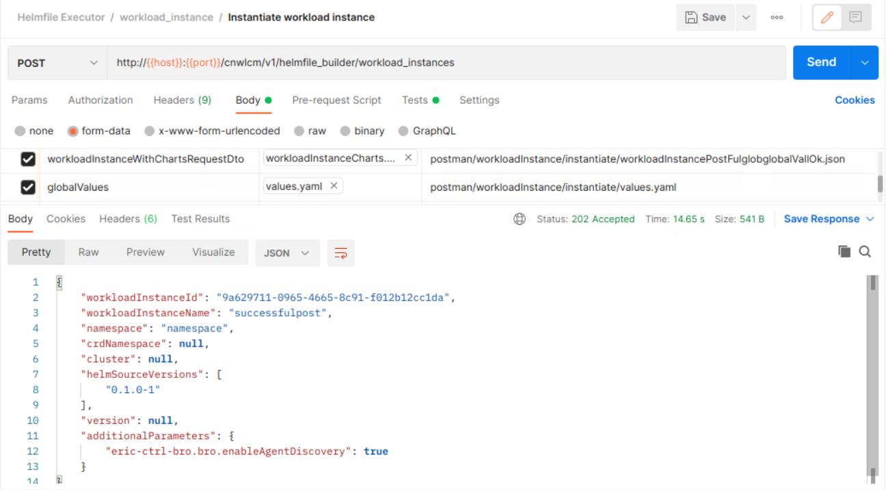

to see the result of the instantiate operation, we need to send the GET request with operation id to the endpoint get operation
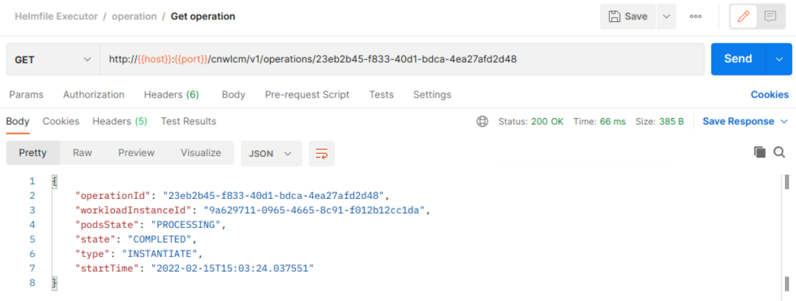

at the end you will see deployed eric-sec-key-management and eric-ctrl-bro on the kubernetes cluster
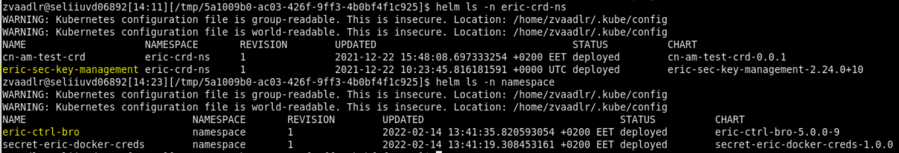

For *auto-rollback.enabled=true*: in case of INSTANTIATE fails, AUTO-ROLLBACK will be applied. It will uninstall all deployed releases, if they were installed during failed INSTANTIATE operation.

### UPDATE

There are several options how to update your instance similar to INSTANTIATE logic: via tgz files (common), via url (Helmfile Fetcher) and via DTO (Helmfile Builder).

#### Common Update

The Update operation sends a PUT request to the server to modify an already deployed instance with a help of new values file or additionalParams or
upgrades already deployed instance (i.e. uplift version of release).
Body of the request includes the following fields:

* helmSource file; (optional)
* updateWorkloadInstanceRequestDto;
* values file; (optional)
* clusterConnectionInfo file; (optional)

There are a few ways of behavior of update method dependents on additional parameters in "workloadInstancePutRequestDto" and values file:

* values file equal to null and additional parameters are present then update previously-stored values with additional parameters;
* values file is present, additional parameters equal to null  then replace previously stored values with a new one;
* values file is present and additional parameters are present then replace previously-stored values with a new one and merge additional params to a new one.

Pay attention that additional parameters have higher priority than data from the values file.

After the operation is completed successfully, the instance will have a new form, and the version of the instance in the DB will be incremented.
Check examples of update

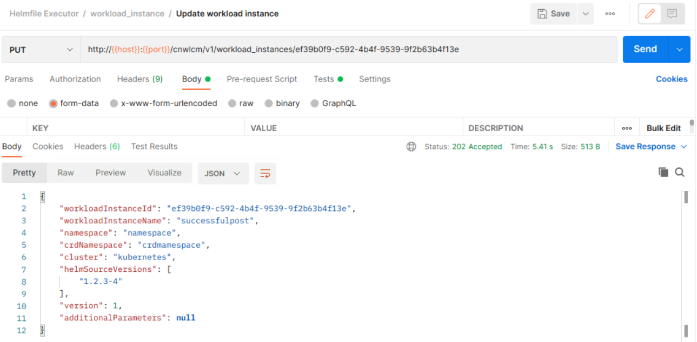

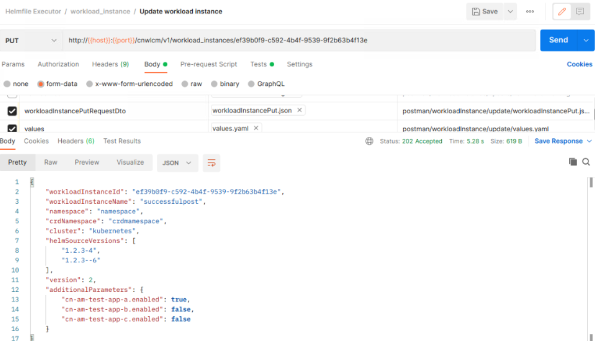

For *auto-rollback.enabled=true*: in case UPDATE fails, AUTO-ROLLBACK will be applied, which will revert the state of the deployed releases to the previous version (state).

Update endpoint produces two types of operation. The first type is "UPDATE" you may see above.
The second is "REINSTANTIATE" it performs in cases where workload instance has previous operation type "TERMINATE" and also request body (helmSource, workloadInstancePutRequestDto, values file) are not present.
Operation type "REINSTANTIATE" doesn't increment the version of workload instance.

#### Update via Helmfile Fetcher

The "update" via Helmfile Fetcher is very similar to common update, just instead of chart.tgz (helmfile.tgz) file you send url to chart (helmfile).
Request performs a PUT request to the server that updates or upgrades already existing workload instance.
Body of the request may include:

* workloadInstanceWithURLPutRequestDto;
* values file;
* clusterConnectionInfo file;

Example of workloadInstanceWithURLPutRequestDto:

```json
{
     "url": "http://eric-lcm-helm-chart-registry.svc.cluster.local:8080/internal/charts/eric-ctrl-bro-7.8.0-34.tgz",
     "additionalParameters": {
        "token": "u23i0291i309e2-72393u"
     }
}
```

There are a few ways in which the behavior of the update method depends on the URL, additional parameters and values file:

* UPDATE: in case URL is null - we utilize the values file or additional params and UPDATE previously installed instance;
* UPGRADE: in case URL is present - we UPGRADE (i.e. redeploy previously installed version of instance). In case values or additional params are
  null, we utilize the values file from the previous version.

Pay attention that additional parameters have higher priority than data from the values file. See example below.

```yaml
#values.yaml
...
app.timeout=2
...

#additionalParams
{
  "app.timeout": 5
}

#result 
app.timeout=5
```

#### Update via Helmfile Builder

The "update" via Helmfile Builder is very similar to common update with basically the same values. Request performs a PUT request to
the server that updates already existing workload instance.
Body of the request may include such optional parameters:

* workloadInstanceWithChartsPutRequestDto;
* globalValues file;
* clusterConnectionInfo file;

Example of workloadInstanceWithChartsPutRequestDto:

```json
{
    "repository": "https://arm.sero.gic.ericsson.se/artifactory/proj-adp-gs-all-helm",
    "charts" :[
        {
            "order": 1,
            "name": "eric-ctrl-bro",
            "version": "5.3.0-29",
            "crd": false
        }
    ]
}
```

There are a few ways of behavior of update method dependents on charts and additional parameters in "workloadInstanceWithChartsPutRequestDto" and
globalValues file:

* globalValues file equal to null and charts or additional parameters are present then update previously deployed charts and additional parameters with new one;
* globalValues file is present, charts or additional parameters equal to null then replace previously stored values with a new one;
* globalValues file is present and charts or additional parameters are present then replace previously-stored values with a new one and deployed new   charts and merge additional params to new one.

Pay attention that additional parameters have higher priority than data from the globalValues file.

After the operation is completed successfully, the instance will have a new form, and the version of the instance will be incremented.

Update on the example of eric-ctrl-bro


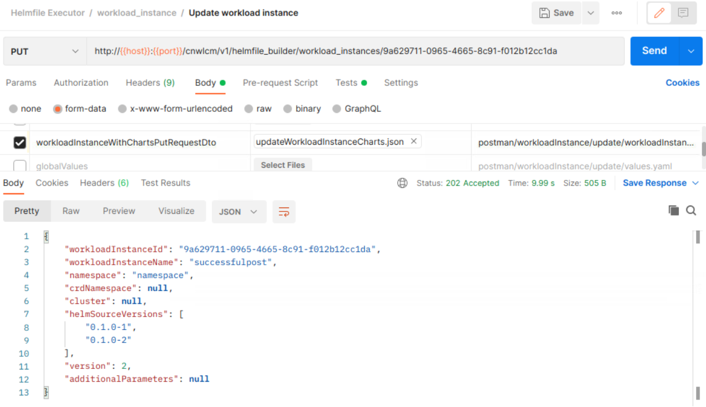

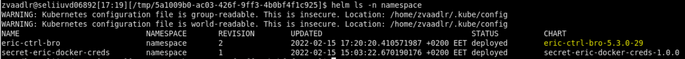

For *auto-rollback.enabled=true*: in case UPDATE fails, AUTO-ROLLBACK will be applied, which will revert the state of the deployed releases to the previous version.

### TERMINATE

Terminate performs a POST request to the server to uninstall an already deployed instance on a Kubernetes cluster.
Additionally, there is functionality to delete the namespace in case there are no viable instances left after the termination process.
This means that if all instances in the namespace are terminated successfully and/or if instances in the namespace are auto-rolled back
after a failed instantiation, and there are no pods in namespace. Only if all required conditions are compliant the namespace can be deleted.
To enable or disable this functionality, set the *deleteNamespace* parameter to *true* or *false*. If *deleteNamespace* parameter is
not present in the request, by default it will be set to *true*.

Body of the request must include:

* workloadInstanceOperationPostRequestDto;
* clusterConnectionInfo file; (optional)

Example of workloadInstanceOperationPostRequestDto

```json
{
  "type": "terminate",
  "deleteNamespace": false
}
```

Send a request from the Postman, you will get a response like this:


We can get operation id from headers as on picture below


The instance will be terminated on cluster, but won`t be deleted from the DB.
To see the result of the terminate operation, we need to send the GET request with operation id to the endpoint get operation


If the Terminate operation wasn't finished successfully, HFE will also clean up resources from the cluster that may
remain after a failed "helm uninstall" command. The list of resources, which will be deleted by namespace and defined label:

* Deployment
* StatefulSet
* ReplicaSet
* Pod
* Ingress
* Service
* ConfigMap
* Secret
* NetworkPolicy
* PodDisruptionBudget
* ServiceAccount
* Job
* RoleBinding
* Role
* PersistentVolumeClaim

### DELETE

This operation performs a DELETE request to the server that deletes previously terminated workload instance entity from a database.
To perform the operation you need:

* TERMINATE an already existing instance on a kubernetes cluster (without it, you couldn't execute operation DELETE)
* specify the workloadInstanceId of the desired workload instance in the header of the request.
  The instance will be deleted.

Delete example in Postman

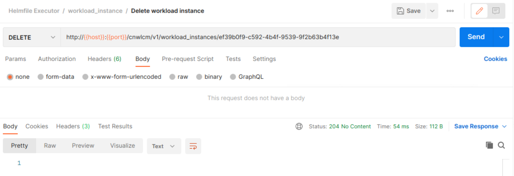

### REINSTANTIATE

Reinstantiate operation performs a PUT request (same that UPDATE operation) to the server that reinstantiate previously terminated existing instance from a kubernetes
cluster. All rules from Update are applyed here as well.

To perform the operation you need:

* TERMINATE the work of an already existing instance on the kubernetes cluster.
* Specify the workloadInstanceId of the desired workload instance in the header of the request.
* Don`t include helmsource, values and additionalParameters to the request.

The instance will be reinstantiated.

Reinstantiate example in Postman

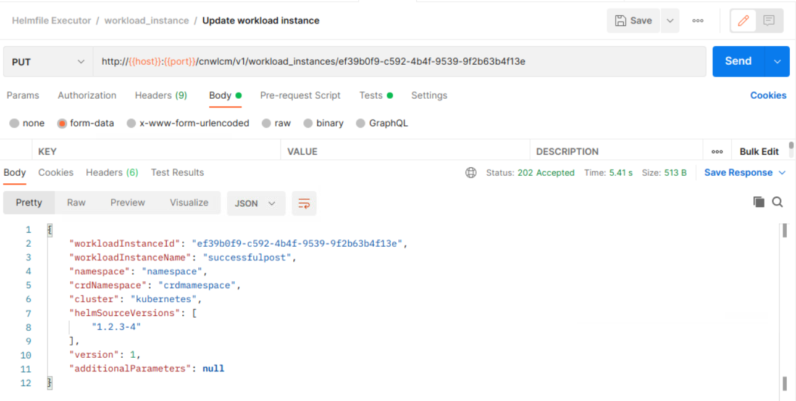

### ROLLBACK (AUTO-ROLLBACK)

The “rollback” operation performs a PUT request to the server, which rolls back to the desired version of the workload instance if you send a
request with the version in updateWorkloadInstanceRequestDto file
(if this is not done, it will simply roll back to the previous version of instance in the kubernetes cluster).

To perform the operation you need:

* Specify the workloadInstanceId of the desired workload instance in the path variable of the request.
* WorkloadInstanceOperationPutRequestDto with version

Example of workloadInstanceOperationPutRequestDto

```json
{
  "version": 1
}
```

The instance will be rolled back.

Rollback example in Postman

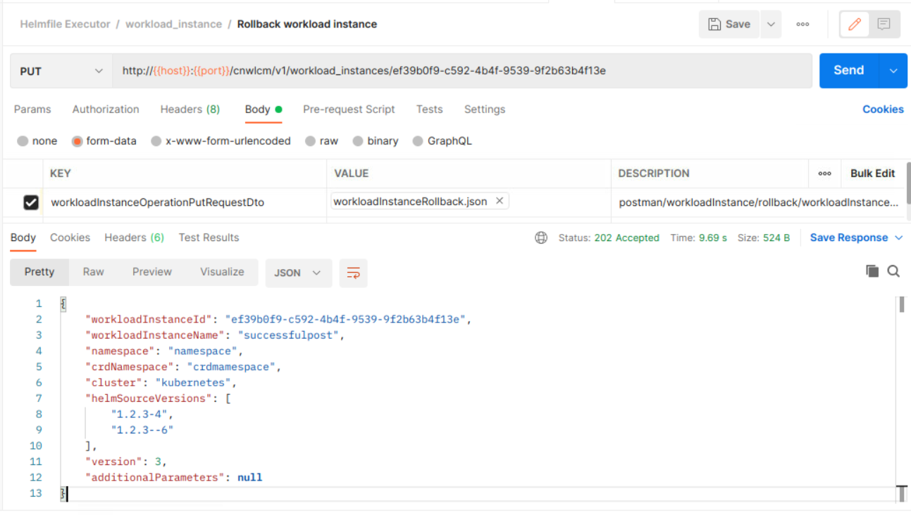

AUTO-ROLLBACK operation is triggered automatically in case operation (instantiate, update, etc.)
failed and *auto-rollback.enabled=true* during deployment of HFE. It rolls back instance to the previous state.

## Tests

### Contract tests

Contract tests are used to test the API itself, not focusing on the performed logic.
Such testing is performing in order to be sure, that changes don`t break the API, so other services, which expose the API, will receive mentioned
response, if they send mentioned request. The whole API is covered by contract tests. In addition, basic classes can be used to model our business logic.

Base classes of contract tests are located in the directory: eric-lcm-helm-executor-server/src/test/java/contracts.base/

Generated tests classes in this category can found in the directory: eric-lcm-helm-executor-server/target/generated-test-sources/contracts/com.ericsson.oss.management.lcm.contracts.base.api/

### Unit tests

All the unit tests reside in the directory: eric-lcm-helm-executor-server/src/test/java/com/ericsson/oss/management/lcm/

### E2E tests

E2E tests emulate the real request from the user and test the logic accordingly. They cover the whole flow of the request from being received by the service to returning a response.
Helm/helmfile commands are not being run during E2E testing so nothing is deployed. The whole API is covered by E2E tests.
All tests in this category can be found in the directory: eric-lcm-helm-executor-server/src/test/java/com/ericsson/oss/management/lcm/e2e/

### Acceptance tests

Acceptance tests are the closest to the real workflow.
They cover the whole request processing logic without any mocking including helm/helmfile commands.
**[More details can be found in test specification](https://eridoc.internal.ericsson.com/eridoc/?docbase=eridoca&locateId=09004cffc8cd81bc#d2)**

There are a number of acceptance tests in the module eric-lcm-helm-executor-testware.

The tests themselves of this category are located in the test directory of the above module.

## References

[1.Project gerrit page](https://gerrit-gamma.gic.ericsson.se/#/admin/projects/OSS/com.ericsson.orchestration.mgmt/eric-lcm-helm-orchestrator)

[2.Helmfile documentation](https://github.com/roboll/helmfile)

[3.Postman documentation](https://learning.postman.com/docs/getting-started/introduction/)
