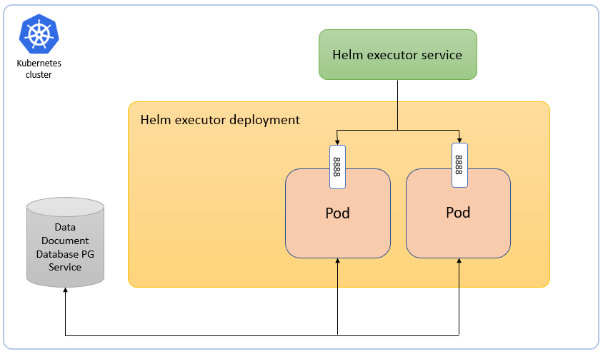

<!--Document Template information:
Prepared:CNAM USER
Approved:***
Document Name:LCM service deployment guide
Revision: {!../../.bob/var.version!}
Date: $(date -u +'%Y-%m-%dT%H:%M:%SZ')
-->

# Helmfile Executor Service Deployment Guide

[TOC]

## Deployment View

The Helmfile Executor is packaged as a Docker container.

It supports deployment on Kubernetes.

It is dependent on PostgreSQL that is installed as a database backend.

The Helmfile Executor Service is stored in one container in a pod.

It supports one or more pod replicas (instances of the service).

At least 2 pod replicas should be used for high availablity, more replicas can be used for scaling.

The REST interface is load balanced (round-robin) between the replicas when using the DNS service name in the cluster.



Figure 2 Deployment view of Helmfile Executor

To deploy the Service, refer to the [Deployment section](#deployment), which:

- explains how to get started using the Helmfile Executor Service in the supported environments.
- specifies configuration options for starting the Helmfile Executor docker container.

If problems occur when using the service, refer to the [Troubleshooting section](#troubleshooting).

## Deployment

This section describes the operational procedures for how to deploy and upgrade the Helmfile Executor Service in a Kubernetes environment with Helm.

It also covers hardening guidelines to consider when deploying this service.

### Prerequisites

- A running Kubernetes environment
- Some knowledge of the Kubernetes environment, including the networking details
- Access rights to deploy and manage workloads
- Availability of the kubectl CLI tool with correct authentication details. Contact the Kubernetes System Admin if needed
- Availability of the helm package
- Availability of Helm charts and Docker images for the service and all dependent services
- Create RoleBinding on the cluster level with cluster admin permissions. See [ClusterRoleBinding creation](#clusterrolebinding-creation)
- Document Database PG Service ([eric-data-document-database-pg](https://adp.ericsson.se/marketplace/document-database-pg/documentation/7.4.0/dpi/service-user-guide#deployment))
- Helm Chart registry ([eric-lcm-helm-chart-registry](https://adp.ericsson.se/marketplace/helm-chart-registry/documentation/5.2.0/dpi/service-user-guide#deployment))

### Deployment in a Kubernetes Environment Using Helm

This section describes how to deploy the service in Kubernetes using Helm and the kubectl CLI client.

Helm is a package manager for Kubernetes that streamlines the installation and management of Kubernetes applications.

### Preparation

Prepare Helm chart and Docker images.

Helm chart in the following [link](https://arm.sero.gic.ericsson.se/artifactory/proj-bdgs-cn-app-mgmt-drop-helm/) can be used for installation.

### Configuration Parameters

The Helmfile Executor Service uses a configuration interface based on environment variables that are defined in the
Helm chart.

You can set these variables during the deployment of the Helm chart (using the --set argument).
Optionality row can contain one of the values: Optional(O) or Mandatory(M)

Parameter | Description | Optionality
---|---|---
postgress.service | Name of Kubernetes service for Document Database PG Service (example:  <postgress.service>.namespace.cluster.local) | M
postgress.dbName | DB name created with Document Database PG Service deployment | M
postgress.credentials.kubernetesSecretName | Name of Kubernetes secret which stores user name and password, used for connecting to Document Database PG Service | M
postgress.credentials.keyForUserId | The key of the entry holding the username to access the database | M
postgress.credentials.keyForUserPw | The key of the entry holding the password to access the database | M
postgress.credentials.keyForSuperPw  | The key of the entry holding the password of Postgres user to access the database | M
postgress.credentials.dbLCMUsername | Username from secret of the Document Database PG Service. This value is MANDATORY in case mTLS enable (global.security.tls.enable=true) | M
container-registry.url | The URL of a the docker container registry that is used to store image of the deployed workload instance ( example: registry.ericsson.se) | M
container-registry.credentials.kubernetesSecretName | Secret name of the Container Registry to connect | M
container-registry.keyForUserId | The key of the entry holding the username to access the Container Registry | O
container-registry.credentials.keyForUserPw | The key of the entry holding the password to access the Container Registry | O
helm-registry.service | Name of the Kubernetes service for Helm Registry  (example: <helm-registry.service>.namespace.cluster.local) | M
helm-registry.name | Registry name created within the Helm Registry deployment | M
helm-registry.credentials.kubernetesSecretName | Secret name of the helm registry to connect | M
helm-registry.credentials.keyForUserId | The key of the entry holding the username to access the Helm Registry | M
helm-registry.credentials.keyForUserPw | The key of the entry holding the password to access the Helm Registry | M
helm-registry.credentials.username | Username from secret of the Helm Registry. This value is MANDATORY in case in case mTLS enable (global.security.tls.enable=true) | M
appArmorProfile.type | Configuration of AppArmor profile type. The following values are possible: ""(default), unconfined, runtime/default, localhost | O
appArmorProfile.localhostProfile | The 'localhost' profile requires a profile name to be provided. Example "profiles/apparmorprofile.json" | O
seccompProfile.type | Configuration of seccomp profile types. The following values are possible: ""(default), Unconfined, RuntimeDefault, Localhost | O
seccompProfile.localhostProfile | The 'Localhost' profile requires a profile name to be provided. Example "profiles/seccompprofile.json" | O
executorConfig.auto-rollback.enabled | Enable or Disable auto-rollback feature | O
executorConfig.deleteNamespace.default | Set flag for namespace deletion. The following values are possible: true(default), false | O
executorConfig.operation.timeout | Set timeout of operation | O
executorConfig.logging.level.root | Set logging level. The following values are possible: INFO(default), DEBUG, ERROR, WARN, TRACE | 0
storage.tmpdir.storageAllocation | Set Size of ephimeral storate (EmptyDir) for store temporary information | O
storage.tmpdir.storageMedium | Set Type of ephimeral storate (EmptyDir) for store temporary information | O
storage.homedir.storageAllocation | Set Size of ephimeral storate (EmptyDir) for store general information needed for eric-lcm-helm-executor | O
storage.homedir.storageMedium | Set Type of ephimeral storate (EmptyDir) for store general information needed for eric-lcm-helm-executor | O

### Storages

The Helmfile Executor is using two main storages with type EmptyDir for store information what is using for correct work.

First one is ``` home-dir-path ```, using for store general information

Second one is ``` eric-lcm-helm-executor-tmp ```, using for store temporary information

Also in case when LogShipper is enabled, we are using third storage with configuration provided by Dynamic Sidecar functionality of LogShipper

### ClusterRoleBinding creation

``` kubectl create clusterrolebinding <NAMESPACE> --clusterrole=cluster-admin --serviceaccount=<NAMESPACE>:<CHART_NAME> ```

### Network Policy

The Helmfile Executor is support network policy.

Network policy enable is possibe with set these parameters:

`.Values.global.networkPolicy.enabled=true`

`.Values.eric-lcm-helm-executor.networkPolicy.enabled=true`

#### Incomming traffic **to** eric-lcm-helm-executor

First way for allow traffic **3rd-party services ==> Helmfile Executor**

Set values in `.Values.eric-lcm-helm-executor.networkPolicy.matchLabels` section.

Type of this section is list.

Example:

```yamlex
eric-lcm-helm-executor:
  networkPolicy:
    matchLabels:
    - eric-service-1
    - eric-service-2
    - eric-service-3
```

Second way for allow traffic **3rd-party services ==> Helmfile Executor**

Set label `eric-lcm-helm-executor-access: "true"` for 3rd-party service

```jamlex
eric-3rd-party-service:
 labels:
   eric-lcm-helm-executor-access: "true"
```

#### Outgoing traffic **from** eric-lcm-helm-executor

First way for allow traffic **Helmfile Executor ==> 3rd-party services**

Configuration for 3rd-party service should be like this:

```yamlex
eric-3rd-party-service:
  networkPolicy:
    matchLabels:
      eric-lcm-helm-executor
```

Second way for allow traffic **Helmfile Executor ==> 3rd-party services**

Set label `eric-3rd-party-service-access: "true"` for 3rd-party service

```yamlex
eric-lcm-helm-executor:
 labels:
   eric-3rd-party-service-access: "true"
```

### Helm Chart Installation of Document Database PG Service

Create a secret and deploy Document Database PG Service according to the installation instructions using the secret to store users and passwords.

[Create kubernetes secret for document database pg](https://adp.ericsson.se/marketplace/document-database-pg/documentation/7.4.0/dpi/service-user-guide#create-kubernetes-secret-for-document-database-pg)

The values of the following Document Database PG Service configuration parameters must match the values set at deployment time of Helmfile Executor Service.

> NOTE: Create the secret in the same namespace as the deployments of Document Database PG Service and Helmfile Executor Service.

The secret is reused for Helmfile Executor deployment.

Helmfile Executor | Default values
---|---
postgress.service | eric-data-document-database-pg
postgress.dbName | lcm-exec-db
postgress.credentials.dbLCMUsername | should be set manually
postgress.credentials.kubernetesSecretName | eric-data-document-database-pg-credentials
postgress.credentials.keyForUserId | custom-user
postgress.credentials.keyForUserPw | custom-pwd
postgress.credentials.keyForSuperPw | super-pwd

IMPORTANT: Value ``` postgress.credentials.keyForSuperPw ``` is MANDATORY. Required for creating DB from Helmfile Executor side.

IMPORTANT: Value ``` postgress.credentials.dbLCMUsername ``` is MANDATORY in case mTLS enable (``` global.security.tls.enable=true ```). Need for generate certificate with correct CN.

IMPORTANT: Value ``` postgress.dbName ``` should be unique, DB name of Helmfile Executor should be different as default Postgres DB name for prevent rewrite public schema with other services what will reuse same PG service.

See [Configuration Parameters](#configuration-parameters) for configuration details.

### Helm Chart Installation of Container registry

Deploy Container Registry such that the following values match the configuration parameters for Helmfile Executor:

In case of Container Registry usage it is necessary to create secret with username/password and specify secret key in deployment values file:

``` kubectl create secret generic <user_secret> --from-literal=container_cred_id=<custom_name> --from-literal=container_cred_pass=<custom_pwd> --namespace=<namespace> ```

The variables specified in the command are as follows:

- <user_secret>: String value. A secret specified by users to store usernames and passwords.
- <custom_name>: String value. A name customized by users to identify user and is used with <custom_pwd>.
- <custom_pwd>: String value. A password customized by users to identify user and is used with <custom_name>.

Helmfile Executor | Default values
---|---
container-registry.url | empty
container-registry.credentials.kubernetesSecretName | eric-lcm-helm-executor-docker-creds
container-registry.credentials.keyForUserId | container_cred_id
container-registry.credentials.keyForUserPw | container_cred_pass

> NOTE: Container Registry requires tls enabled for images to be pulled successfully.

### Helm Chart Installation of Helm Chart Registry

The following values for Helm Chart Registry deployment must be the same as corresponding configuration parameters for Helmfile Executor:

Helmfile Executor | Default values
---|---
helm-registry.service | eric-lcm-helm-chart-registry
helm-registry.externalPort | 8080
helm-registry.name | internal
helm-registry.credentials.kubernetesSecretName | eric-lcm-helm-chart-registry
helm-registry.credentials.keyForUserId | BASIC_AUTH_USER
helm-registry.credentials.keyForUserPw | BASIC_AUTH_PASS
helm-registry.credentials.username | should be set manually

> NOTE: Helmfile Executor communicate with Helm Chart Registry ONLY over Kubernetes service name of Helm Chart Registry.
> Helmfile Executor expects that Helm Chart Registry will be deployed in the same namespace.

### Helm Chart Installation of Helmfile Executor Service

> NOTE: Ensure all dependent services are deployed and healthy before you continue with this step (see previous chapter).

Users can override the default values provided in the values.yaml template of the Helm chart.

The recommended parameters to override are listed in the following section: [Configuration Parameters](#configuration-parameters).

#### Deploy the Helmfile Executor Service

##### Helmfile Executor Service Deployment

```bash
helm install <RELEASE_NAME> <CHART_REFERENCE> --namespace <NAMESPACE> \
--set postgress.service=<POSTGRESS_SERVICE_NAME> \
--set postgress.dbName=<POSTGRESS_DB_NAME> \
--set postgress.credentials.kubernetesSecretName=<POSTGRESS_DB_SecretName> \
--set postgress.credentials.keyForUserId=<POSTGRESS_DB_USER_KEY> \
--set postgress.credentials.keyForUserPw=<POSTGRESS_DB_PASSWORD_KEY> \
--set helm-registry.credentials.kubernetesSecretName=<HELM_CHART_REGISTRY_SECRET> \
--set container-registry.url=<DOCKER_REGISTRY_URL> \
--set container-registry.credentials.kubernetesSecretName=<CONTAINER_SECRET_NAME> \
--set container-registry.credentials.keyForUserId=<CONTAINER_SECRET_USER_KEY> \
--set container-registry.credentials.keyForUserPw=<CONTAINER_SECRET_PASSWORD_KEY> \
--set docker-registry.password=<DOCKER_REGISTRY_PASSWORD> \
```

##### Verify the Availability of the Helmfile Executor Service

In order to check a successful deployment of the Helmfile Executor Service, the following steps can be performed

- Check if the chart is installed with the provided release name and in the related namespace using ``` helm ls ``` command

```bash
helm ls
```

Output:

```bash
NAME                        NAMESPACE                   REVISION    UPDATED     STATUS      CHART                               APP VERSION
eric-lcm-helm-executor      test-deployment-namespace   1           2021-01-01 01:01:01.8697656 +0100 CET    deployed    eric-lcm-helm-executor-0.1.0-76      0.1.0
```

Chart status should be reported as DEPLOYED.

- Verify the status of the Helm chart deployed, by getting the status for your chart installed

```bash
helm status eric-lcm-helm-executor -n <NAMESPACE>
```

Example output:

```bash
LAST DEPLOYED: Fri Jan 01 01:01:01 2021
NAMESPACE: test-deployment-namespace
STATUS: DEPLOYED
```

Chart status should be reported as DEPLOYED.

```bash
kubectl get deployment -n <NAMESPACE>
```

Example output:

```bash
NAME                                     READY   UP-TO-DATE   AVAILABLE   AGE
eric-lcm-helm-executor                    2/2     2            2          99d
```

## Troubleshooting

### Prerequisites for Troubleshooting

- ``` kubectl ``` CLI tool properly configured
- ``` helm ``` CLI tool properly configured

## References

- [End2End Offline Certificate Enrollment](https://eteamspace.internal.ericsson.com/display/AA/End2End+Offline+Certificate+Enrollment?src=contextnavpagetreemode)

- [End2End Online Certificate Enrollment](https://eteamspace.internal.ericsson.com/display/AA/End2End+Online+Certificate+Enrollment?src=contextnavpagetreemode)
