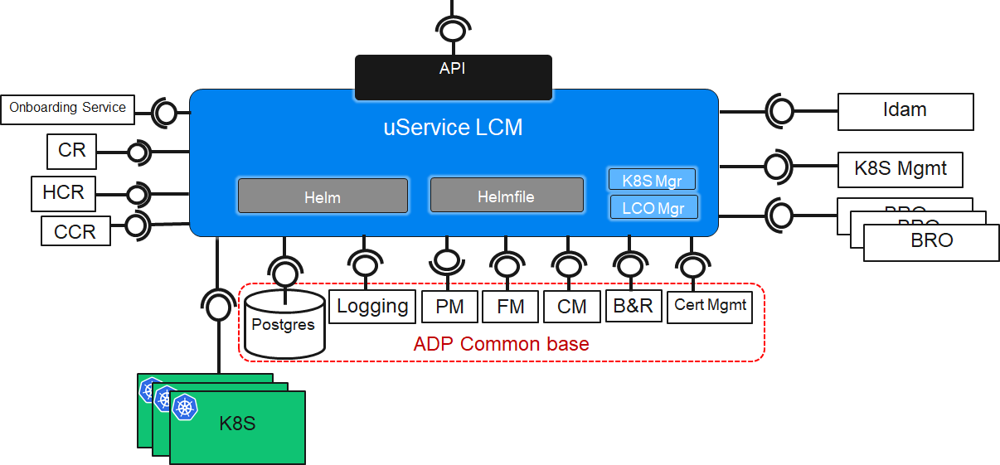

<!--Document Template information:
Prepared:CNAM USEr
Approved:***
Document Name:LCM user guide
Revision: {!../../.bob/var.version!}
Date: $(date -u +'%Y-%m-%dT%H:%M:%SZ')
-->

# Helmfile Executor User Guide

[TOC]

## Overview

This service will accept Helmfile.tgz files and apply them to a target cluster. This results in one or more Helm releases installed on the cluster
in one or more namespaces, in parallel/sequential groups. Helmfile leverages the helm-diff plugin to find out what Helm releases need to be
updated and delegates the execution to Helm itself. To support legacy this service will also accept integration charts for those who haven't
migrated to Helmfile yet.

### Supported Use Cases

This chapter gives an overview of the supported use cases. For further information on Application Lifecycle Management (ALM) kindly refer to
**[ALM usecase view-point](https://eteamspace.internal.ericsson.com/display/AA/ALM+usecase+view-point)**.

Use Case ID | Use Case Title | Compliance | Maturity
 ---|---|---|---
UC.AM.LCM.1 | Manually onboard application package | Not supported | n.a.
UC.AM.LCM.2 | Update an already on-boarded Application Package | Not supported | n.a.
UC.AM.LCM.3 | Manually instantiate application | Fully supported | Alpha
UC.AM.LCM.4 | Manually trigger application upgrade | Fully supported | Alpha
UC.AM.LCM.5 | Manually triggered Application rollback (to be deprecated by Application downgrade UC) | Fully supported | Alpha
UC.AM.LCM.6 | Manually triggered Application scale | Not supported yet | Alpha
UC.AM.LCM.7 | Manually terminate Application | Fully supported | Alpha
UC.AM.LCM.8 | Manually remove application | Fully supported | Alpha
UC.AM.LCM.9 | Software driven onboarding of Application | Not supported | n.a.
UC.AM.LCM.10 | Software driven incremental onboarding of Application | Not supported | n.a.
UC.AM.LCM.11 | Software triggered instantiation of Application | Fully supported | Alpha
UC.AM.LCM.12 | Software triggered upgrade of Application | Fully supported | Alpha
UC.AM.LCM.13 | Software driven terminate of Application | Fully supported | Alpha
UC.AM.LCM.14 | Policy driven removal of Application | Fully supported | Alpha
UC.AM.LCM.OPERATOR.SERVICE.CREATE | Create a service component instance managed by LCM operator | Fully supported | Alpha
UC.AM.LCM.OPERATOR.SERVICE.DELETE | Delete a service component instance managed by LCM operator | Fully supported | Alpha
UC.AM.LCM.OPERATOR.Scale | Adapt resource footprint of ADP service components | Not supported | n.a.

### Architecture

The following picture shows the Helmfile Executor Service and its architectural context.



Figure 1 Architecture view of Helmfile Executor

#### Interfaces

Type of interface | Description
---|---
Onboarding Service | Interface to fetch workload artefacts
HCR (Helm Chart Registry) | Interface to store and fetch helm charts
CR (Container Registry) | Interface to store helmfiles and to check container images are present
Idam | Interface to check authenticity of received LCM operation requests
K8S Manager | Interface to add/delete/modify K8S clusters
Data Persistence Service (Postgres) | The data interface allows to store workload inventory data, workload operations data, K8S access data and other persistent data
Logging | Interface
PM | ADP Core PM Service API
FM | ADP Core FM Service API to raise alarms
CM | Interface used to configure this service
BRO | This interface is to invoke, query and configure backup and restore operations of workloads life cycle managed bythis service. This service interacts with BROs running in workloads.
Cert Mgmt | Interface to LCM certificates for all external interfaces
K8S | Interface to interact with k8S API Server to LCM workloads

Not supported in current version:

- Onboarding Service

- Idam

### Dimensioning and Characteristics

#### Dimensioning

The service provides by default resource request values and resource limit values as part of the Helm chart.

These values correspond to a default size for deployment of an instance.

This chapter gives guidance in how to do service dimensioning and how to change the default values when needed.

#### Consider Dimensioning Aspects

Consider the basic dimensioning attributes listed in the Configuration Parameters section and decide on a target initial API transaction capacity on the utilized interfaces.

The below provided figures are approximate and for guidance only. Figures were produced using a reference system.

The values below reflect modelled traffic, i.e. when only a single interface is utilized.

Based on the above values, derive the resource requirements for Kubernetes.

The values below are defined in Kubernetes resource units.

Image name | Initial number of instances | Local storage per instance | Resource request memory | Resource request CPU | Resource limit memory | Resource limit CPU
---|---|---|---|------|-------|---
eric-lcm-executor | 2 | None | 1Gi | 100m | 1.5Gi | 400m

#### Override Default Dimensioning Configuration

If other values than the default resource request and default resource limit values are preferred, they must be overridden at deployment time.

Here is an example of the helm install command where resource requests and resource limits are set for a minimum configuration

```bash
helm install eric-lcm-helm-orchestrator \
https://arm.sero.gic.ericsson.se/artifactory/proj-bdgs-cn-app-mgmt-drop-helm/eric-lcm-helm-orchestrator/eric-lcm-helm-orchestrator-0.1.0-78.tgz \
--namespace test-deployment-namespace \
--set resources.requests.cpu=100m \
--set resources.requests.memory=384Mi \
--set resources.limits.cpu=400m \
--set resources.limits.memory=1500Mi
```

Image name | Resource request memory | Resource request CPU | Resource limit memory | Resource limit CPU
---|---|---|-------|---
eric-lcm-helm-executor | 1Gi | 100m | 1.5Gi | 400m

To use minimum configuration, override the default values for resource requests and resource limits in the Helm chart at deployment time.

#### Use Maximum (Default) Configuration per Service Instance

The maximum recommended configuration per instance is provided as default in the Helm chart.

Both Resource Request values and Resource Limit values are included in the Helm charts.

### Scaling

#### Helmfile Executor Scaling

The Helmfile Executor Service supports manual scaling up.

Scaling Supported (Yes/No) | Minimum number of instances | Maximum number of recommended instances
---|---|---
Yes | 2 | 8

The Helmfile Executor Service Scaling Procedure Scaling is done with kubectl command, for example:

```bash
kubectl scale --replicas=3 deployment/eric-lcm-helm-executor
```

#### Upgrade - In Service Software Upgrade

The Helmfile Executor supports upgrade without loss of persistent service configuration data, and notifications.

## Hardening

The service is by default pre-hardened. No additional hardening is required. The following pre-hardening actions have been made:

1. The service is built on a minimalistic container image with small footprint. Only the required libraries are included.
2. The service utilizes a container optimized operating system (Common Base OS) and latest security patches are applied.
3. The container goes through vulnerability scanning.
4. The service is configured to the strict minimum of services and ports to minimize the attack surface.

## Upgrade Procedure

The Helmfile Executor Service supports upgrade without loss of persistent service configuration data.

In Kubernetes the Helm chart upgrade can be done to migrate the Helmfile Executor Service from the existing to a
higher version.

- Check if Helmfile Executor Service is installed in the system with a specific chart version.

```bash
helm ls
```

This should show that Helmfile Executor Service is installed having a release name and a specific chart revision and the chart status should be reported as DEPLOYED.

- Check service type for the current Executor Service Service deployment

```bash
kubectl -n <NAMESPACE> describe service <SERVICE_NAME>
```

Should print out the service details. Check the Type entry.

``` <NAMESPACE> ```: String value, the namespace where Helmfile Executor Service is installed.
``` <SERVICE_NAME> ```: The service name used during installation, typically eric-lcm-helm-executor.

- Migrate to a higher version using Helm upgrade procedure

```bash
helm upgrade <RELEASE_NAME> <CHART_REFERENCE>
```

- Should give the output Release <RELEASE_NAME> has been upgraded.
- <RELEASE_NAME>: String value, a name to identify and manage your Helm chart.
- <CHART_REFERENCE>: A path to a packaged chart, a path to an unpacked chart directory or a URL to upgrade to.

```bash
helm upgrade eric-lcm-helm-executor \
https://arm.sero.gic.ericsson.se/artifactory/proj-bdgs-cn-app-mgmt-drop-helm/eric-lcm-helm-executor/eric-lcm-helm-executor-0.1.0-76.tgz
```

## Operation and Maintenance

### Backup and Restore

Helmfile executor does not support backup and restore itself.

For backup and restore data what Helmfile executor saved in Document Database PG Service and Object Storage MN use next instructions:

- Backup and Restore for database: [Backup and Restore](https://adp.ericsson.se/marketplace/document-database-pg/documentation/8.18.0/dpi/service-user-guide#backup-and-restore)

- Backup and Restore for S3 buckets: [Service User Guide](https://adp.ericsson.se/marketplace/object-storage-mn/documentation/2.9.0/dpi/service-user-guide)

## Logging

### Common logging format

In order to efficiently troubleshoot applications based on ADP services behaving consistently, a common JSON logging format is defined. ADP services
need to write log events to stdout according to a common ADP logging JSON format.

The ADP Log event schema defines the following mandatory elements:

- the version of the logging schema. The logging schema semantic version is included to be able to properly evolve both log producers and clients that
  are processing logs in a controlled fashion as the format evolves. Equivalent to VERSION in RFC 5424.
- the timestamp. The timestamp is expressed in local time with UTC offset and millisecond precision according to TIMESTAMP in RFC 5424. This gives
  the appropriate precision in logs ordering and avoid any confusion related to the interaction of multiple geographical areas. The format is
  YYYY-MM-DDThh:mm:ss.sss±hh:mm Note: if UTC is the reference for the specified time, both "Z" and "+00:00" notations are accepted. For example, these
  2 time representations are valid for UTC and mean the same: "2018-02-01T12:00:10.002+00:00" and "2018-02-01T12:00:10.002Z"
- the severity according to the applicable sub-set of RFC 5424 severity levels
- the service_id. This is the name of the service at the origin of the logged event. Equivalent to APP-NAME in RFC 5424. Typically a
  constant/hard-coded value.
- the actual message: a freeform text that describes the logged event in a human readable way, preferably without control characters even escaped.
  Equivalent to MSG in RFC 5424.

Example output:

```bash
{"timestamp":"2021-12-21T09:55:14.401Z","version":"1.0.0","message":"Received a Get request to get operation by id","logger":"com.ericsson.oss.management.lcm.presentation.controllers.OperationsController","thread":"http-nio-8888-exec-1","path":"http://0.0.0.0:8888/cnwlcm/v1/operations/17e83c1b-d801-4f1c-8f3f-cffa4f2c89c8","service_id":"eric-lcm-helm-executor","severity":"info"}
```

### Severity level usage

 Minimalist approach | Fine grain approach | Main usage                            | What
----|---|----|--------------------------------------------------------------------------------------------------------------------------------------------
 "info"              | "warning"           | Indications for abnormal situations or oddities that are handled by the service | Usage of deprecated APIs; Retrying some operation; Using secondary service instance when primary one does not answer
 "info"              | "info"              | Coarse grain indications related to service initialization and processing       | Service start/stop; Configuration assumption; Positive resolution of service dependencies; Successful completion of significant operations

### Security logging

Security logging based on ADP rules. This log is used to identify the tag "log audit"
Example output:

``` "log audit: Received a Post request to workload instances (INSTANTIATE). WorkloadInstance name successfulpost" ```

This type of logging is used for the following operations:

- **Instantiate**

- **Terminate**

- **Update**

- **Rollback**

- **Delete**

## PM metrics

Operations with metrics will be proceeded by the PM (Performance Management) Server.

The PM Service implements PM Server for PaaS environments. The PM Server provides performance metrics handling capabilities. PM metrics are used in
multiple operational activities such as problem detection, verification of configuration changes, analysis of usage patterns, scaling decisions,
trends as well as network dimensioning.

The PM server pulls, webscrapes, metrics from PM providers via INT.PM.PULL interface. PM Server is use HTTP API to collect metric data from Helmfile
Executor.

According the PM design rules, ADP application provides the following types of metrics: Resource metrics and Service metrics

The Helmfile executor service responding / submitting requests continually monitors according to RED methodology. According to design rule
DR-D470206-121-A, the executor service D Helmfile provides a metric with the total number of requests processed.

This metric is provided for the following operations:

- **Instantiate**: ``` hfe.instantiation.requests.total ```

- **Terminate**: ``` hfe.termination.requests.total ```

- **Update**: ``` hfe.upgrade.requests.total ```

## Data persistence

To save the values or day-0-config received from the user, the Helmfile Executor uses saving data in a relational database.
Postgress is used as a relational database.

## Password handling

> **Note:** DB is not included in HFE, the password change procedure is described in the DB documentation.

[Here is an official procedure how to change password in "Document Database PG"](https://adp.ericsson.se/marketplace/document-database-pg/documentation/8.17.0/dpi/service-user-guide#change-the-password-of-db-user-after-non-operator-deployment)

### Authorization by mTLS

When we use mTLS connection and apply "Change the Password of DB User after Non-Operator Deployment" procedure - everything works fine
and no additional action is required from HFE side.

### Authorization by username and password

When mTLS disabled, we use a username/password authorization and apply the "Change the Password of DB User after Non-Operator Deployment" procedure
for the HFE, it is necessary to perform additional steps so that the HFE has updated password data.
Namely:

- Change password for HFE DB user in secret:

```bash
kubectl edit secret <DB-CREDENTIALS-SECRET> -n <NAMESPACE>
```

- Restart all HFE pods:

```bash
kubectl delete pod <NAME_OF_HFE_POD> -n <NAMESPACE>
```

## Security Guidelines

The HFE service supports mTLS communication with dependent components directly and via ServiceMesh. To enable communication through ServiceMesh with dependent components, these two parameters, ``` global.serviceMesh.enabled=true ``` and ``` global.security.tls.enabled=true ```, must be enabled.
> **Note:** Preference is given to ServiceMesh communication.

### Operative Tasks

Helmfile Executor service does not include any operative tasks.

### Internal Ports

The following ports are cluster internal ports and not exposed to the outside:

 Service or Interface name | Protocol | IP Address Type | Port | Transport Protocol | IP Version
---------------------------|----------|-----------------|------|--------------------|------------
 REST API                  | HTTP     | OAM IP          | 8888 | TCP                | IPv4
> **Note:** The port value port can be overwritten by setting <service.port> in deployment configuration.

### Security Events That Can Be Logged

List the security events for which logging is supported by the product:

- any incoming http/https request.
- interactions with the service local file system.
- interactions with the Kubernetes cluster.
- code execution errors.
- list of executed commands on Kubernetes cluster with their results.
- secrets modification.
- security logging.

## Managing parameters in values file

Helmfile Executor merges additional parameters from request JSON and values.yaml file from request.

> **Note:** parameters from request will be **overwritten**.

Here are parameters that are processed during this operation (these are the only parameters which are controlled and modified by Helmfile Executor):

 Parameter name        | Origin / Source                 | Origin name / Value
-----------------------|---------------------------------|---------------------------------------------------------------------------------
 global.registry.url   | Helmfile Executor values        | eric-lcm-helm-executor.container-registry.url
 global.crd.namespace  | request JSON                    | **crdNamespace** field or "eric-crd-ns" if mentioned field isn't specified
 global.app.namespace  | request JSON                    | **namespace** field
 global.chart.registry | Helmfile Executor values        | eric-lcm-helm-executor.helm-registry.name
 global.app.enabled    | Helmfile Executor internal flag | *true* for **Instantiate** and **Update**, *false* for **Terminate** operations
 global.pullSecret     | request JSON                    | "regcred-" + **workloadInstanceName** field

Also, Helmfile Executor verify parameters for key **image.repo.prefix** and if it's present - attach the value 
corresponding to such key to **global.registry.url** value (example: container-registry/prefix). This parameter will be 
removed from parameters immediately after edition of registry url and won't play any role in the further deployment.  